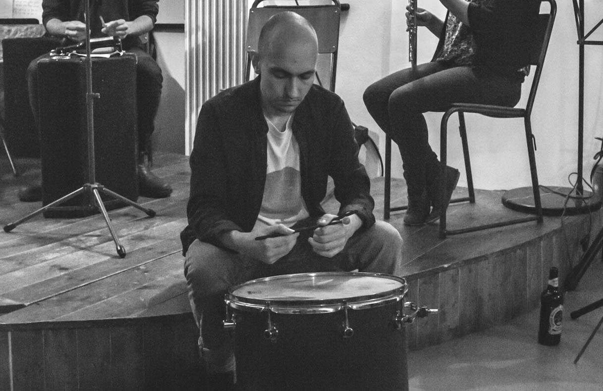



My current research builds on recent work in 4E cognitive science, developing methods to infer high level features of user experience and behaviour from signatures in user movement. More broadly, I am interested in Complexity Science as an source of interaction-focused methodologies for HCI. I am also interested in *eudaimonic* approaches to understanding UX, such as Self Determination Theory.

My research connects the two strands of my academic background - **philosophy** and **computer science**, with my interest in **cognitive science**. I’m influenced by ideas from phenomenology, enactivism, and ecological psychology, but also interested in the possibilities of quantitative and computational approaches. 

I believe a rigorous approach to cognitive embodiment, can help drive forward understanding of interaction. Rather than treating interaction as simply the execution of the user's action plan, it can help us consider the influence of context, other users, and the feedback relationship between user and technology. The computational approaches to embodiment I am investigating go beyond description and may be implemented in code and incorporated into adaptive technologies.
<!-- like "readiness-to-hand", affordances and context-embeddedness, as a conceptual skeleton for understanding the dynamics of tool interaction. At the same time, I am interested in developing hypotheses from this conceptual skeleton, and fleshing them out with empirical research, based on modern approaches in embodied cognitive science. Ultimately I would like to see these results incorporated into into dynamic, adaptive technology. -->

Aside from this, I am a musician, and interested in tools for musical creativity. I have performed at venues around Europe, composed music for theatre and art installations, and I also develop and share software for music making. Before returning to academia, I worked as the ‘Information and Performance Systems Manager’ for a large NHS trust - doing a mixture of database management, project management, BI development & IT strategy.

I have pages on [twitter](https://twitter.com/__stillPoint), [github](https://github.com/danBennettDev/), [google scholar](https://scholar.google.com/citations?user=KxrABMIAAAAJ&hl=en) and I have a [newsletter]({{site.baseurl}}/about/mailingList.html), and an <a href='&#109;&#97;&#105;&#108;&#116;&#111;&#58;&#100;&#98;&#49;&#53;&#50;&#51;&#55;&#64;&#98;&#114;&#105;&#115;&#116;&#111;&#108;&#46;&#97;&#99;&#46;&#117;&#107;'>email address</a>
